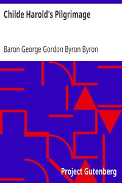

# Childe Harold's Pilgrimage <kbd>5131</kbd>

## Authors

 - Byron, George Gordon Byron, Baron <small>(1788 - 1824)</small>

## Subjects

 - English poetry
 - Pilgrims and pilgrimages -- Europe -- Poetry
 - Voyages and travels -- Poetry

## Download

 - https://www.gutenberg.org/files/5131/5131.zip
 - https://www.gutenberg.org/cache/epub/5131/pg5131.cover.medium.jpg
 - https://www.gutenberg.org/files/5131/5131-h.zip
 - https://www.gutenberg.org/ebooks/5131.html.images
 - https://www.gutenberg.org/ebooks/5131.txt.utf-8
 - https://www.gutenberg.org/ebooks/5131.kindle.images
 - https://www.gutenberg.org/ebooks/5131.epub.images
 - https://www.gutenberg.org/ebooks/5131.rdf

## Book Shelves

