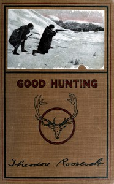

# Good hunting; in pursuit of big game in the West <kbd>67632</kbd>

## Authors

 - Roosevelt, Theodore <small>(1858 - 1919)</small>

## Subjects

 - Hunting -- United States

## Download

 - https://www.gutenberg.org/ebooks/67632.rdf
 - https://www.gutenberg.org/ebooks/67632.txt.utf-8
 - https://www.gutenberg.org/cache/epub/67632/pg67632.cover.medium.jpg
 - https://www.gutenberg.org/ebooks/67632.kindle.images
 - https://www.gutenberg.org/ebooks/67632.epub.images
 - https://www.gutenberg.org/files/67632/67632-0.zip
 - https://www.gutenberg.org/files/67632/67632-h.zip
 - https://www.gutenberg.org/files/67632/67632-0.txt
 - https://www.gutenberg.org/files/67632/67632-h/67632-h.htm

## Book Shelves

