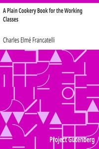

# A Plain Cookery Book for the Working Classes <kbd>22114</kbd>

## Authors

 - Francatelli, Charles Elmé <small>(1805 - 1876)</small>

## Subjects

 - Cooking, British
 - Working class -- Great Britain

## Download

 - https://www.gutenberg.org/files/22114/22114-h/22114-h.htm
 - https://www.gutenberg.org/files/22114/22114-8.txt
 - https://www.gutenberg.org/files/22114/22114-8.zip
 - https://www.gutenberg.org/cache/epub/22114/pg22114.cover.medium.jpg
 - https://www.gutenberg.org/files/22114/22114.txt
 - https://www.gutenberg.org/ebooks/22114.html.images
 - https://www.gutenberg.org/ebooks/22114.txt.utf-8
 - https://www.gutenberg.org/ebooks/22114.kindle.images
 - https://www.gutenberg.org/ebooks/22114.epub.images
 - https://www.gutenberg.org/ebooks/22114.rdf

## Book Shelves

 - Cookbooks and Cooking
 - Technology
