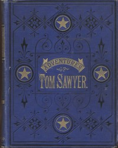

# The Adventures of Tom Sawyer, Complete <kbd>74</kbd>

## Authors

 - Twain, Mark <small>(1835 - 1910)</small>

## Subjects

 - Adventure stories
 - Bildungsromans
 - Boys -- Fiction
 - Child witnesses -- Fiction
 - Humorous stories
 - Male friendship -- Fiction
 - Mississippi River Valley -- Fiction
 - Missouri -- Fiction
 - Runaway children -- Fiction
 - Sawyer, Tom (Fictitious character) -- Fiction

## Download

 - https://www.gutenberg.org/files/74/74-0.zip
 - https://www.gutenberg.org/cache/epub/74/pg74.cover.small.jpg
 - https://www.gutenberg.org/files/74/74-h/74-h.htm
 - https://www.gutenberg.org/files/74/74-0.txt
 - https://www.gutenberg.org/ebooks/74.html.images
 - https://www.gutenberg.org/ebooks/74.kindle.images
 - https://www.gutenberg.org/ebooks/74.rdf
 - https://www.gutenberg.org/ebooks/74.epub.images

## Book Shelves

 - Banned Books List from the American Library Association
 - Banned Books from Anne Haight's list
