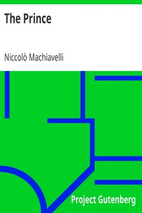

# The Prince <kbd>1232</kbd>

## Authors

 - Machiavelli, Niccolò <small>(1469 - 1527)</small>

## Subjects

 - Political ethics -- Early works to 1800
 - Political science -- Philosophy -- Early works to 1800
 - State, The -- Early works to 1800

## Download

 - https://www.gutenberg.org/files/1232/1232-h/1232-h.htm
 - https://www.gutenberg.org/files/1232/1232-h.zip
 - https://www.gutenberg.org/cache/epub/1232/pg1232.cover.medium.jpg
 - https://www.gutenberg.org/files/1232/1232-0.txt
 - https://www.gutenberg.org/ebooks/1232.html.images
 - https://www.gutenberg.org/ebooks/1232.rdf
 - https://www.gutenberg.org/ebooks/1232.epub.images
 - https://www.gutenberg.org/ebooks/1232.kindle.images

## Book Shelves

 - Banned Books from Anne Haight's list
 - Harvard Classics
 - Philosophy
 - Politics
