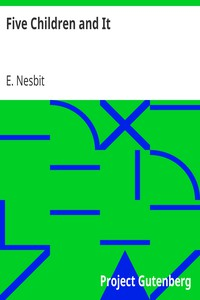

# Five Children and It <kbd>17314</kbd>

## Authors

 - Nesbit, E. (Edith) <small>(1858 - 1924)</small>

## Subjects

 - Brothers and sisters -- Fiction
 - Fairies -- Fiction
 - Great Britain -- History -- Edward VII, 1901-1910 -- Fiction
 - Wishes -- Fiction

## Download

 - https://www.gutenberg.org/files/17314/17314-8.zip
 - https://www.gutenberg.org/cache/epub/17314/pg17314.cover.medium.jpg
 - https://www.gutenberg.org/files/17314/17314.zip
 - https://www.gutenberg.org/files/17314/17314-h/17314-h.htm
 - https://www.gutenberg.org/files/17314/17314-8.txt
 - https://www.gutenberg.org/ebooks/17314.html.images
 - https://www.gutenberg.org/ebooks/17314.txt.utf-8
 - https://www.gutenberg.org/ebooks/17314.kindle.images
 - https://www.gutenberg.org/ebooks/17314.epub.images
 - https://www.gutenberg.org/ebooks/17314.rdf

## Book Shelves

 - Children's Fiction
 - Children's Literature
