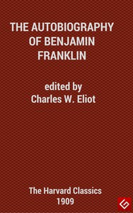

# The Autobiography of Benjamin Franklin <kbd>148</kbd>

## Authors

 - Franklin, Benjamin <small>(1706 - 1790)</small>

## Subjects

 - Franklin, Benjamin, 1706-1790
 - Statesmen -- United States -- Biography

## Download

 - https://www.gutenberg.org/files/148/148-h.zip
 - https://www.gutenberg.org/cache/epub/148/pg148.cover.small.jpg
 - https://www.gutenberg.org/files/148/148.zip
 - https://www.gutenberg.org/files/148/148.txt
 - https://www.gutenberg.org/ebooks/148.html.images
 - https://www.gutenberg.org/files/148/148-8.txt
 - https://www.gutenberg.org/ebooks/148.kindle.images
 - https://www.gutenberg.org/ebooks/148.txt.utf-8
 - https://www.gutenberg.org/ebooks/148.rdf
 - https://www.gutenberg.org/ebooks/148.epub.images

## Book Shelves

 - Harvard Classics
