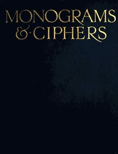

# Monograms & Ciphers <kbd>40023</kbd>

## Authors

 - Carlton Studio <small>(null - null)</small>
 - Turbayne, A. A. (Albert Angus) <small>(1866 - 1940)</small>

## Subjects

 - Monograms

## Download

 - https://www.gutenberg.org/files/40023/40023.zip
 - https://www.gutenberg.org/cache/epub/40023/pg40023.cover.medium.jpg
 - https://www.gutenberg.org/files/40023/40023-h.zip
 - https://www.gutenberg.org/files/40023/40023-h/40023-h.htm
 - https://www.gutenberg.org/ebooks/40023.html.images
 - https://www.gutenberg.org/ebooks/40023.txt.utf-8
 - https://www.gutenberg.org/ebooks/40023.rdf
 - https://www.gutenberg.org/ebooks/40023.kindle.images
 - https://www.gutenberg.org/ebooks/40023.epub.images

## Book Shelves

