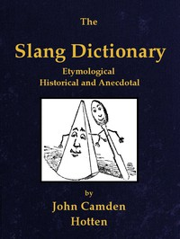

# The Slang Dictionary: Etymological, Historical and Andecdotal <kbd>42108</kbd>

## Authors

 - Hotten, John Camden <small>(1832 - 1873)</small>

## Subjects

 - English language -- Dialects -- England -- London -- Glossaries, vocabularies, etc.
 - English language -- England -- London -- Slang -- Dictionaries
 - London (England) -- Languages -- Dictionaries

## Download

 - https://www.gutenberg.org/files/42108/42108-0.zip
 - https://www.gutenberg.org/files/42108/42108-8.zip
 - https://www.gutenberg.org/files/42108/42108.zip
 - https://www.gutenberg.org/cache/epub/42108/pg42108.cover.small.jpg
 - https://www.gutenberg.org/files/42108/42108-8.txt
 - https://www.gutenberg.org/files/42108/42108-h/42108-h.htm
 - https://www.gutenberg.org/ebooks/42108.html.images
 - https://www.gutenberg.org/ebooks/42108.rdf
 - https://www.gutenberg.org/ebooks/42108.kindle.images
 - https://www.gutenberg.org/ebooks/42108.epub.images

## Book Shelves

