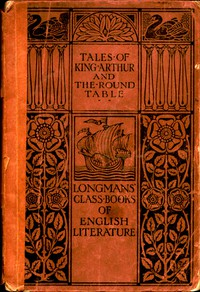

# Tales of King Arthur and the Round Table, Adapted from the Book of Romance <kbd>49057</kbd>

## Authors

## Subjects

 - Arthur, King -- Legends
 - Arthurian romances -- Adaptations
 - Folklore -- England
 - Knights and knighthood -- Folklore

## Download

 - https://www.gutenberg.org/files/49057/49057-8.txt
 - https://www.gutenberg.org/files/49057/49057-0.txt
 - https://www.gutenberg.org/files/49057/49057-8.zip
 - https://www.gutenberg.org/files/49057/49057-h/49057-h.htm
 - https://www.gutenberg.org/cache/epub/49057/pg49057.cover.medium.jpg
 - https://www.gutenberg.org/ebooks/49057.html.images
 - https://www.gutenberg.org/ebooks/49057.epub.images
 - https://www.gutenberg.org/ebooks/49057.rdf
 - https://www.gutenberg.org/ebooks/49057.kindle.images

## Book Shelves

