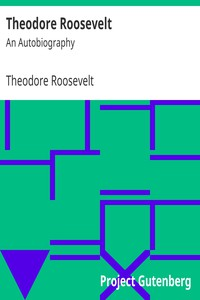

# Theodore Roosevelt: An Autobiography <kbd>3335</kbd>

## Authors

 - Roosevelt, Theodore <small>(1858 - 1919)</small>

## Subjects

 - Presidents -- United States -- Biography
 - Roosevelt, Theodore, 1858-1919

## Download

 - https://www.gutenberg.org/files/3335/3335-8.zip
 - https://www.gutenberg.org/cache/epub/3335/pg3335.cover.small.jpg
 - https://www.gutenberg.org/files/3335/3335-h/3335-h.htm
 - https://www.gutenberg.org/files/3335/3335.zip
 - https://www.gutenberg.org/ebooks/3335.html.images
 - https://www.gutenberg.org/files/3335/3335.txt
 - https://www.gutenberg.org/ebooks/3335.txt.utf-8
 - https://www.gutenberg.org/ebooks/3335.kindle.images
 - https://www.gutenberg.org/ebooks/3335.rdf
 - https://www.gutenberg.org/ebooks/3335.epub.images

## Book Shelves

