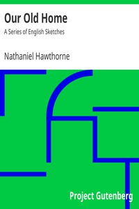

# Our Old Home: A Series of English Sketches <kbd>8090</kbd>

## Authors

 - Hawthorne, Nathaniel <small>(1804 - 1864)</small>

## Subjects

 - Americans -- England -- History -- 19th century
 - England -- Description and travel
 - England -- Social life and customs -- 19th century
 - Hawthorne, Nathaniel, 1804-1864 -- Homes and haunts -- England

## Download

 - https://www.gutenberg.org/files/8090/8090-h/8090-h.htm
 - https://www.gutenberg.org/files/8090/8090.zip
 - https://www.gutenberg.org/cache/epub/8090/pg8090.cover.medium.jpg
 - https://www.gutenberg.org/files/8090/8090.txt
 - https://www.gutenberg.org/ebooks/8090.html.images
 - https://www.gutenberg.org/ebooks/8090.kindle.images
 - https://www.gutenberg.org/ebooks/8090.rdf
 - https://www.gutenberg.org/ebooks/8090.epub.images
 - https://www.gutenberg.org/ebooks/8090.txt.utf-8

## Book Shelves

