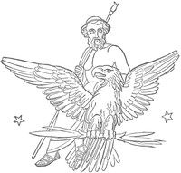

# The Iliad of Homer: Translated into English Blank Verse by William Cowper <kbd>16452</kbd>

## Authors

 - Homer <small>(-750 - -650)</small>

## Subjects

 - Achilles (Mythological character) -- Poetry
 - Epic poetry, Greek -- Translations into English
 - Trojan War -- Poetry

## Download

 - https://www.gutenberg.org/files/16452/16452-h/16452-h.htm
 - https://www.gutenberg.org/files/16452/16452-0.zip
 - https://www.gutenberg.org/files/16452/16452-h.zip
 - https://www.gutenberg.org/cache/epub/16452/pg16452.cover.medium.jpg
 - https://www.gutenberg.org/files/16452/16452-0.txt
 - https://www.gutenberg.org/ebooks/16452.txt.utf-8
 - https://www.gutenberg.org/ebooks/16452.rdf
 - https://www.gutenberg.org/ebooks/16452.epub.images
 - https://www.gutenberg.org/ebooks/16452.kindle.images

## Book Shelves

 - Classical Antiquity
 - Poetry
