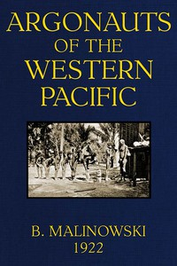

# Argonauts of the Western Pacific: An Account of Native Enterprise and Adventure in the Archipelagoes of Melanesian New Guinea <kbd>55822</kbd>

## Authors

 - Malinowski, Bronislaw <small>(1884 - 1942)</small>

## Subjects

 - Barter -- Papua New Guinea -- Trobriand Islands
 - Ethnology -- Papua New Guinea -- Trobriand Islands
 - Folklore -- Papua New Guinea -- Trobriand Islands
 - Kula exchange -- Papua New Guinea -- Trobriand Islands
 - Massim (Papua New Guinean people) -- Rites and ceremonies
 - Trobriand Islands (Papua New Guinea) -- Social life and customs

## Download

 - https://www.gutenberg.org/files/55822/55822-8.zip
 - https://www.gutenberg.org/files/55822/55822-h.zip
 - https://www.gutenberg.org/cache/epub/55822/pg55822.cover.medium.jpg
 - https://www.gutenberg.org/ebooks/55822.html.images
 - https://www.gutenberg.org/files/55822/55822-h/55822-h.htm
 - https://www.gutenberg.org/ebooks/55822.kindle.images
 - https://www.gutenberg.org/ebooks/55822.rdf
 - https://www.gutenberg.org/ebooks/55822.epub.images
 - https://www.gutenberg.org/ebooks/55822.txt.utf-8

## Book Shelves

