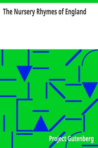

# The Nursery Rhymes of England <kbd>32415</kbd>

## Authors

## Subjects

 - Nursery rhymes, English
 - Oral tradition -- England

## Download

 - https://www.gutenberg.org/files/32415/32415-h.zip
 - https://www.gutenberg.org/cache/epub/32415/pg32415.cover.medium.jpg
 - https://www.gutenberg.org/files/32415/32415-h/32415-h.htm
 - https://www.gutenberg.org/files/32415/32415.txt
 - https://www.gutenberg.org/ebooks/32415.html.images
 - https://www.gutenberg.org/files/32415/32415-8.txt
 - https://www.gutenberg.org/ebooks/32415.txt.utf-8
 - https://www.gutenberg.org/ebooks/32415.epub.images
 - https://www.gutenberg.org/ebooks/32415.rdf
 - https://www.gutenberg.org/ebooks/32415.kindle.images

## Book Shelves

