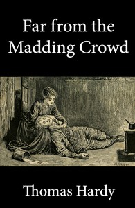

# Far from the Madding Crowd <kbd>27</kbd>

## Authors

 - Hardy, Thomas <small>(1840 - 1928)</small>

## Subjects

 - Didactic fiction
 - Farm life -- Fiction
 - Love stories
 - Pastoral fiction
 - Triangles (Interpersonal relations) -- Fiction
 - Wessex (England) -- Fiction
 - Women farmers -- Fiction

## Download

 - https://www.gutenberg.org/ebooks/27.html.images
 - https://www.gutenberg.org/cache/epub/27/pg27.cover.medium.jpg
 - https://www.gutenberg.org/files/27/27-h.zip
 - https://www.gutenberg.org/files/27/27-0.txt
 - https://www.gutenberg.org/ebooks/27.kindle.images
 - https://www.gutenberg.org/ebooks/27.rdf
 - https://www.gutenberg.org/ebooks/27.epub.images

## Book Shelves

