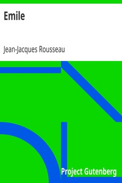

# Emile <kbd>5427</kbd>

## Authors

 - Rousseau, Jean-Jacques <small>(1712 - 1778)</small>

## Subjects

 - Education -- Early works to 1800

## Download

 - https://www.gutenberg.org/files/5427/5427-h/5427-h.htm
 - https://www.gutenberg.org/files/5427/5427.zip
 - https://www.gutenberg.org/files/5427/5427-h.zip
 - https://www.gutenberg.org/cache/epub/5427/pg5427.cover.medium.jpg
 - https://www.gutenberg.org/ebooks/5427.html.images
 - https://www.gutenberg.org/ebooks/5427.kindle.images
 - https://www.gutenberg.org/ebooks/5427.epub.images
 - https://www.gutenberg.org/ebooks/5427.txt.utf-8
 - https://www.gutenberg.org/ebooks/5427.rdf

## Book Shelves

 - Banned Books from Anne Haight's list
