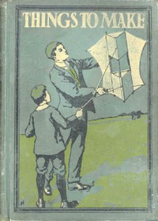

# Things To Make <kbd>14664</kbd>

## Authors

 - Williams, Archibald <small>(1871 - 1934)</small>

## Subjects

 - Do-it-yourself work
 - Industrial arts

## Download

 - https://www.gutenberg.org/cache/epub/14664/pg14664.cover.small.jpg
 - https://www.gutenberg.org/files/14664/14664-0.zip
 - https://www.gutenberg.org/files/14664/14664-pdf.zip
 - https://www.gutenberg.org/files/14664/14664-0.txt
 - https://www.gutenberg.org/files/14664/14664-pdf.pdf
 - https://www.gutenberg.org/ebooks/14664.txt.utf-8
 - https://www.gutenberg.org/files/14664/14664-h/14664-h.htm
 - https://www.gutenberg.org/ebooks/14664.epub.images
 - https://www.gutenberg.org/ebooks/14664.rdf
 - https://www.gutenberg.org/ebooks/14664.kindle.images

## Book Shelves

 - Crafts
