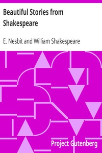

# Beautiful Stories from Shakespeare <kbd>1430</kbd>

## Authors

 - Shakespeare, William <small>(1564 - 1616)</small>
 - Nesbit, E. (Edith) <small>(1858 - 1924)</small>

## Subjects

 - Children's literature
 - Shakespeare, William, 1564-1616 -- Stories, plots, etc. -- Juvenile literature

## Download

 - https://www.gutenberg.org/files/1430/1430-0.txt
 - https://www.gutenberg.org/files/1430/1430-0.zip
 - https://www.gutenberg.org/files/1430/1430-h/1430-h.htm
 - https://www.gutenberg.org/cache/epub/1430/pg1430.cover.medium.jpg
 - https://www.gutenberg.org/files/1430/1430.txt
 - https://www.gutenberg.org/ebooks/1430.html.images
 - https://www.gutenberg.org/ebooks/1430.epub.images
 - https://www.gutenberg.org/ebooks/1430.rdf
 - https://www.gutenberg.org/ebooks/1430.kindle.images

## Book Shelves

 - Children's Literature
