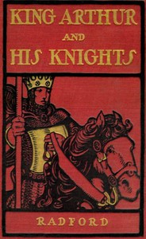

# King Arthur and His Knights <kbd>21865</kbd>

## Authors

 - Warren, Maude Radford <small>(1875 - 1934)</small>

## Subjects

 - Arthur, King -- Juvenile literature

## Download

 - https://www.gutenberg.org/files/21865/21865.zip
 - https://www.gutenberg.org/cache/epub/21865/pg21865.cover.medium.jpg
 - https://www.gutenberg.org/files/21865/21865-h/21865-h.htm
 - https://www.gutenberg.org/ebooks/21865.html.images
 - https://www.gutenberg.org/files/21865/21865-8.txt
 - https://www.gutenberg.org/ebooks/21865.kindle.images
 - https://www.gutenberg.org/ebooks/21865.txt.utf-8
 - https://www.gutenberg.org/ebooks/21865.epub.images
 - https://www.gutenberg.org/ebooks/21865.rdf

## Book Shelves

