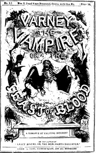

# Varney the Vampire; Or, the Feast of Blood <kbd>14833</kbd>

## Authors

 - Rymer, James Malcolm <small>(null - 1884)</small>
 - Prest, Thomas Peckett <small>(1810 - 1859)</small>

## Subjects

 - Gothic fiction
 - Horror tales
 - Vampires -- Fiction

## Download

 - https://www.gutenberg.org/files/14833/14833-h.zip
 - https://www.gutenberg.org/files/14833/14833-h/14833-h.htm
 - https://www.gutenberg.org/cache/epub/14833/pg14833.cover.small.jpg
 - https://www.gutenberg.org/files/14833/14833.txt
 - https://www.gutenberg.org/ebooks/14833.html.images
 - https://www.gutenberg.org/ebooks/14833.txt.utf-8
 - https://www.gutenberg.org/ebooks/14833.epub.images
 - https://www.gutenberg.org/ebooks/14833.rdf
 - https://www.gutenberg.org/ebooks/14833.kindle.images

## Book Shelves

 - Horror
