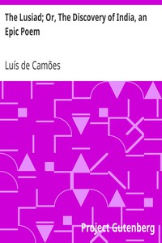

# The Lusiad; Or, The Discovery of India, an Epic Poem <kbd>32528</kbd>

## Authors

 - Camões, Luís de <small>(null - 1580)</small>

## Subjects

 - Epic poetry, Portuguese -- Translations into English
 - Explorers -- Portugal -- Poetry
 - Gama, Vasco da, 1469-1524 -- Poetry
 - India -- Discovery and exploration -- Poetry
 - Portugal -- Colonies -- Asia -- Poetry
 - Portuguese poetry -- Classical period, 1500-1700 -- Translations into English

## Download

 - https://www.gutenberg.org/files/32528/32528.txt
 - https://www.gutenberg.org/cache/epub/32528/pg32528.cover.medium.jpg
 - https://www.gutenberg.org/files/32528/32528-0.txt
 - https://www.gutenberg.org/files/32528/32528-8.zip
 - https://www.gutenberg.org/files/32528/32528-h/32528-h.htm
 - https://www.gutenberg.org/ebooks/32528.html.images
 - https://www.gutenberg.org/files/32528/32528-8.txt
 - https://www.gutenberg.org/ebooks/32528.kindle.images
 - https://www.gutenberg.org/ebooks/32528.rdf
 - https://www.gutenberg.org/ebooks/32528.epub.images

## Book Shelves

