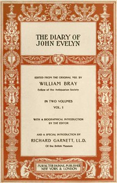

# The Diary of John Evelyn (Volume 1 of 2) <kbd>41218</kbd>

## Authors

 - Evelyn, John <small>(1620 - 1706)</small>

## Subjects

 - Evelyn, John, 1620-1706 -- Diaries
 - Great Britain -- Court and courtiers -- Early works to 1800
 - Great Britain -- History -- Stuarts, 1603-1714
 - Great Britain -- Social life and customs -- Early works to 1800

## Download

 - https://www.gutenberg.org/files/41218/41218.zip
 - https://www.gutenberg.org/files/41218/41218-8.zip
 - https://www.gutenberg.org/files/41218/41218-h/41218-h.htm
 - https://www.gutenberg.org/cache/epub/41218/pg41218.cover.medium.jpg
 - https://www.gutenberg.org/ebooks/41218.html.images
 - https://www.gutenberg.org/ebooks/41218.rdf
 - https://www.gutenberg.org/ebooks/41218.kindle.images
 - https://www.gutenberg.org/ebooks/41218.txt.utf-8
 - https://www.gutenberg.org/ebooks/41218.epub.images

## Book Shelves

