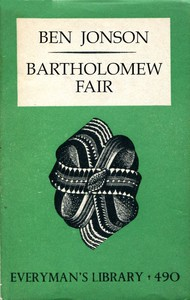

# Bartholomew Fair: A Comedy <kbd>49461</kbd>

## Authors

 - Jonson, Ben <small>(null - 1637)</small>

## Subjects

 - Comedies
 - English drama -- 17th century

## Download

 - https://www.gutenberg.org/files/49461/49461-h/49461-h.htm
 - https://www.gutenberg.org/files/49461/49461-8.txt
 - https://www.gutenberg.org/files/49461/49461-h.zip
 - https://www.gutenberg.org/cache/epub/49461/pg49461.cover.small.jpg
 - https://www.gutenberg.org/ebooks/49461.rdf
 - https://www.gutenberg.org/ebooks/49461.epub.images
 - https://www.gutenberg.org/ebooks/49461.kindle.images
 - https://www.gutenberg.org/ebooks/49461.txt.utf-8

## Book Shelves

