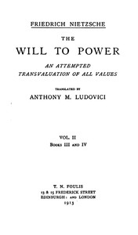

# The Will to Power: An Attempted Transvaluation of All Values. Book III and IV <kbd>52915</kbd>

## Authors

 - Nietzsche, Friedrich Wilhelm <small>(1844 - 1900)</small>

## Subjects

 - Nihilism (Philosophy)
 - Power (Philosophy)
 - Values

## Download

 - https://www.gutenberg.org/cache/epub/52915/pg52915.cover.medium.jpg
 - https://www.gutenberg.org/files/52915/52915-h.zip
 - https://www.gutenberg.org/files/52915/52915-0.zip
 - https://www.gutenberg.org/ebooks/52915.html.images
 - https://www.gutenberg.org/ebooks/52915.kindle.images
 - https://www.gutenberg.org/ebooks/52915.rdf
 - https://www.gutenberg.org/ebooks/52915.epub.images

## Book Shelves

