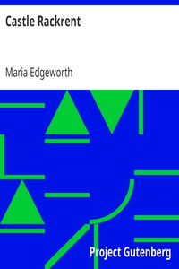

# Castle Rackrent <kbd>1424</kbd>

## Authors

 - Edgeworth, Maria <small>(1767 - 1849)</small>

## Subjects

 - Administration of estates -- Fiction
 - Domestic fiction
 - Ireland -- Fiction
 - Ireland -- Social life and customs -- Fiction
 - Landlord and tenant -- Fiction
 - Landowners -- Fiction
 - Pastoral fiction
 - Poor families -- Fiction
 - Rich people -- Fiction
 - Rural conditions -- Fiction

## Download

 - https://www.gutenberg.org/files/1424/1424-h/1424-h.htm
 - https://www.gutenberg.org/files/1424/1424-h.zip
 - https://www.gutenberg.org/cache/epub/1424/pg1424.cover.medium.jpg
 - https://www.gutenberg.org/files/1424/1424-0.zip
 - https://www.gutenberg.org/files/1424/1424-0.txt
 - https://www.gutenberg.org/ebooks/1424.txt.utf-8
 - https://www.gutenberg.org/ebooks/1424.epub.images
 - https://www.gutenberg.org/ebooks/1424.rdf
 - https://www.gutenberg.org/ebooks/1424.kindle.images

## Book Shelves

