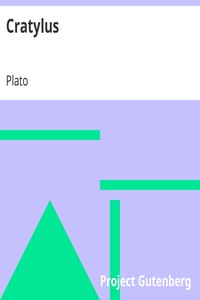

# Cratylus <kbd>1616</kbd>

## Authors

 - Plato <small>(-428 - -348)</small>

## Subjects

 - Classical literature
 - Language and languages -- Philosophy

## Download

 - https://www.gutenberg.org/files/1616/1616.zip
 - https://www.gutenberg.org/cache/epub/1616/pg1616.cover.medium.jpg
 - https://www.gutenberg.org/files/1616/1616.txt
 - https://www.gutenberg.org/ebooks/1616.html.images
 - https://www.gutenberg.org/files/1616/1616-h/1616-h.htm
 - https://www.gutenberg.org/ebooks/1616.rdf
 - https://www.gutenberg.org/ebooks/1616.epub.images
 - https://www.gutenberg.org/ebooks/1616.kindle.images
 - https://www.gutenberg.org/ebooks/1616.txt.utf-8

## Book Shelves

