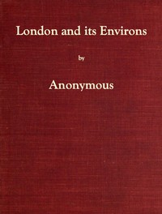

# London and Its Environs Described, vol. 1 (of 6): Containing an Account of Whatever is Most Remarkable for Grandeur, Elegance, Curiosity or Use, in the City and in the Country Twenty Miles Round It <kbd>59466</kbd>

## Authors

 - Anonymous <small>(null - null)</small>

## Subjects

 - London (England) -- Description and travel -- Early works to 1800
 - London (England) -- Gazetteers -- Early works to 1800

## Download

 - https://www.gutenberg.org/cache/epub/59466/pg59466.cover.small.jpg
 - https://www.gutenberg.org/files/59466/59466-h.zip
 - https://www.gutenberg.org/ebooks/59466.html.images
 - https://www.gutenberg.org/files/59466/59466-0.txt
 - https://www.gutenberg.org/files/59466/59466-h/59466-h.htm
 - https://www.gutenberg.org/ebooks/59466.kindle.images
 - https://www.gutenberg.org/ebooks/59466.rdf
 - https://www.gutenberg.org/ebooks/59466.epub.images

## Book Shelves

