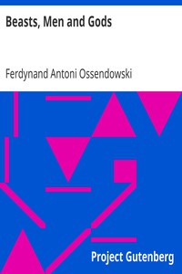

# Beasts, Men and Gods <kbd>2067</kbd>

## Authors

 - Ossendowski, Ferdynand Antoni <small>(1878 - 1945)</small>

## Subjects

 - Communism -- Soviet Union
 - Mongolia -- Description and travel

## Download

 - https://www.gutenberg.org/files/2067/2067.zip
 - https://www.gutenberg.org/files/2067/2067-0.txt
 - https://www.gutenberg.org/cache/epub/2067/pg2067.cover.small.jpg
 - https://www.gutenberg.org/files/2067/2067.txt
 - https://www.gutenberg.org/ebooks/2067.html.images
 - https://www.gutenberg.org/files/2067/2067-h/2067-h.htm
 - https://www.gutenberg.org/ebooks/2067.rdf
 - https://www.gutenberg.org/ebooks/2067.epub.images
 - https://www.gutenberg.org/ebooks/2067.kindle.images

## Book Shelves

