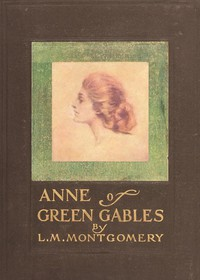

# Anne of Green Gables <kbd>64365</kbd>

## Authors

 - Montgomery, L. M. (Lucy Maud) <small>(1874 - 1942)</small>

## Subjects

 - Bildungsromans
 - Canada -- History -- 1867-1914 -- Fiction
 - Country life -- Prince Edward Island -- Fiction
 - Friendship -- Fiction
 - Girls -- Fiction
 - Islands -- Fiction
 - Orphans -- Fiction
 - Prince Edward Island -- History -- 20th century -- Fiction
 - Shirley, Anne (Fictitious character) -- Fiction

## Download

 - https://www.gutenberg.org/files/64365/64365-h/64365-h.htm
 - https://www.gutenberg.org/files/64365/64365-h.zip
 - https://www.gutenberg.org/cache/epub/64365/pg64365.cover.medium.jpg
 - https://www.gutenberg.org/files/64365/64365-0.txt
 - https://www.gutenberg.org/ebooks/64365.html.images
 - https://www.gutenberg.org/ebooks/64365.epub.images
 - https://www.gutenberg.org/ebooks/64365.rdf
 - https://www.gutenberg.org/ebooks/64365.kindle.images

## Book Shelves

