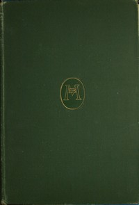

# Parts of Speech: Essays on English <kbd>67503</kbd>

## Authors

 - Matthews, Brander <small>(1852 - 1929)</small>

## Subjects

 - Americanisms
 - English language
 - Spelling reform

## Download

 - https://www.gutenberg.org/files/67503/67503-0.zip
 - https://www.gutenberg.org/files/67503/67503-h.zip
 - https://www.gutenberg.org/cache/epub/67503/pg67503.cover.medium.jpg
 - https://www.gutenberg.org/ebooks/67503.rdf
 - https://www.gutenberg.org/ebooks/67503.txt.utf-8
 - https://www.gutenberg.org/ebooks/67503.kindle.images
 - https://www.gutenberg.org/ebooks/67503.epub.images
 - https://www.gutenberg.org/files/67503/67503-0.txt
 - https://www.gutenberg.org/files/67503/67503-h/67503-h.htm

## Book Shelves

