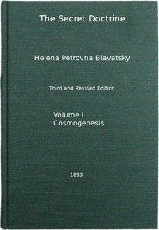

# The Secret Doctrine, Vol. 1 of 4: The Synthesis of Science, Religion, and Philosophy <kbd>54824</kbd>

## Authors

 - Blavatsky, H. P. (Helena Petrovna) <small>(1831 - 1891)</small>

## Subjects

 - Theosophy

## Download

 - https://www.gutenberg.org/cache/epub/54824/pg54824.cover.medium.jpg
 - https://www.gutenberg.org/files/54824/54824-h.zip
 - https://www.gutenberg.org/files/54824/54824-0.zip
 - https://www.gutenberg.org/files/54824/54824-h/54824-h.html
 - https://www.gutenberg.org/files/54824/54824-tei.zip
 - https://www.gutenberg.org/files/54824/54824.txt
 - https://www.gutenberg.org/files/54824/54824-8.txt
 - https://www.gutenberg.org/files/54824/54824-tei/54824-tei.tei
 - https://www.gutenberg.org/ebooks/54824.rdf
 - https://www.gutenberg.org/ebooks/54824.kindle.images
 - https://www.gutenberg.org/ebooks/54824.epub.images
 - https://www.gutenberg.org/files/54824/54824-pdf.pdf

## Book Shelves

