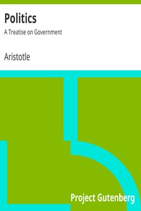

# Politics: A Treatise on Government <kbd>6762</kbd>

## Authors

 - Aristotle <small>(-384 - -322)</small>

## Subjects

 - Political science -- Early works to 1800

## Download

 - https://www.gutenberg.org/files/6762/6762-h.zip
 - https://www.gutenberg.org/files/6762/6762.txt
 - https://www.gutenberg.org/cache/epub/6762/pg6762.cover.medium.jpg
 - https://www.gutenberg.org/files/6762/6762-h/6762-h.htm
 - https://www.gutenberg.org/ebooks/6762.html.images
 - https://www.gutenberg.org/ebooks/6762.kindle.images
 - https://www.gutenberg.org/ebooks/6762.rdf
 - https://www.gutenberg.org/ebooks/6762.epub.images
 - https://www.gutenberg.org/ebooks/6762.txt.utf-8

## Book Shelves

 - Classical Antiquity
 - Philosophy
 - Politics
