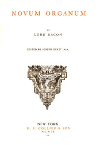

# Novum Organum; Or, True Suggestions for the Interpretation of Nature <kbd>45988</kbd>

## Authors

 - Bacon, Francis <small>(1561 - 1626)</small>

## Subjects

 - Induction (Logic) -- Early works to 1800
 - Science -- Methodology -- Early works to 1800

## Download

 - https://www.gutenberg.org/files/45988/45988-0.zip
 - https://www.gutenberg.org/ebooks/45988.html.images
 - https://www.gutenberg.org/ebooks/45988.txt.utf-8
 - https://www.gutenberg.org/files/45988/45988-0.txt
 - https://www.gutenberg.org/cache/epub/45988/pg45988.cover.medium.jpg
 - https://www.gutenberg.org/ebooks/45988.kindle.images
 - https://www.gutenberg.org/ebooks/45988.rdf
 - https://www.gutenberg.org/ebooks/45988.epub.images

## Book Shelves

