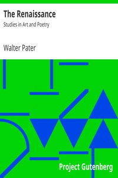

# The Renaissance: Studies in Art and Poetry <kbd>2398</kbd>

## Authors

 - Pater, Walter <small>(1839 - 1894)</small>

## Subjects

 - Arts, Renaissance
 - Renaissance
 - Renaissance -- Italy

## Download

 - https://www.gutenberg.org/cache/epub/2398/pg2398.cover.small.jpg
 - https://www.gutenberg.org/files/2398/2398.zip
 - https://www.gutenberg.org/files/2398/2398-h/2398-h.htm
 - https://www.gutenberg.org/files/2398/2398.txt
 - https://www.gutenberg.org/ebooks/2398.html.images
 - https://www.gutenberg.org/ebooks/2398.kindle.images
 - https://www.gutenberg.org/ebooks/2398.txt.utf-8
 - https://www.gutenberg.org/ebooks/2398.rdf
 - https://www.gutenberg.org/ebooks/2398.epub.images

## Book Shelves

