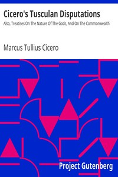

# Cicero's Tusculan Disputations: Also, Treatises On The Nature Of The Gods, And On The Commonwealth <kbd>14988</kbd>

## Authors

 - Cicero, Marcus Tullius <small>(-106 - -43)</small>

## Subjects

 - Gods, Roman -- Early works to 1800
 - Happiness -- Early works to 1800
 - Political science -- Early works to 1800
 - Rome -- Politics and government -- 265-30 B.C.
 - State, The -- Early works to 1800
 - Theology -- Early works to 1800

## Download

 - https://www.gutenberg.org/cache/epub/14988/pg14988.cover.small.jpg
 - https://www.gutenberg.org/files/14988/14988-8.zip
 - https://www.gutenberg.org/files/14988/14988-8.txt
 - https://www.gutenberg.org/ebooks/14988.html.images
 - https://www.gutenberg.org/files/14988/14988-h/14988-h.htm
 - https://www.gutenberg.org/files/14988/14988.txt
 - https://www.gutenberg.org/ebooks/14988.kindle.images
 - https://www.gutenberg.org/ebooks/14988.txt.utf-8
 - https://www.gutenberg.org/ebooks/14988.epub.images
 - https://www.gutenberg.org/ebooks/14988.rdf

## Book Shelves

 - Classical Antiquity
