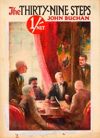

# The Thirty-Nine Steps <kbd>558</kbd>

## Authors

 - Buchan, John <small>(1875 - 1940)</small>

## Subjects

 - Hannay, Richard (Fictitious character) -- Fiction
 - Intelligence service -- Great Britain -- Fiction
 - Spy stories
 - World War, 1914-1918 -- Fiction

## Download

 - https://www.gutenberg.org/files/558/558-h.zip
 - https://www.gutenberg.org/files/558/558-h/558-h.htm
 - https://www.gutenberg.org/cache/epub/558/pg558.cover.medium.jpg
 - https://www.gutenberg.org/ebooks/558.html.images
 - https://www.gutenberg.org/files/558/558-0.txt
 - https://www.gutenberg.org/ebooks/558.kindle.images
 - https://www.gutenberg.org/ebooks/558.rdf
 - https://www.gutenberg.org/ebooks/558.epub.images

## Book Shelves

 - Adventure
 - Movie Books
 - Mystery Fiction
