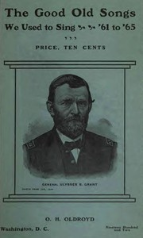

# The Good Old Songs We Used to Sing, '61 to '65 <kbd>21566</kbd>

## Authors

 - Oldroyd, Osborn H. (Osborn Hamiline) <small>(1842 - 1930)</small>

## Subjects

 - United States -- History -- Civil War, 1861-1865 -- Poetry
 - United States. Army -- Insignia
 - War songs -- United States

## Download

 - https://www.gutenberg.org/files/21566/21566-h.zip
 - https://www.gutenberg.org/files/21566/21566.txt
 - https://www.gutenberg.org/files/21566/21566-h/music/columbia.midi
 - https://www.gutenberg.org/cache/epub/21566/pg21566.cover.medium.jpg
 - https://www.gutenberg.org/files/21566/21566-h/21566-h.htm
 - https://www.gutenberg.org/ebooks/21566.html.images
 - https://www.gutenberg.org/ebooks/21566.kindle.images
 - https://www.gutenberg.org/ebooks/21566.txt.utf-8
 - https://www.gutenberg.org/ebooks/21566.epub.images
 - https://www.gutenberg.org/ebooks/21566.rdf

## Book Shelves

 - Music
