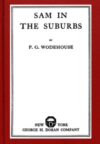

# Sam in the Suburbs <kbd>67368</kbd>

## Authors

 - Wodehouse, P. G. (Pelham Grenville) <small>(1881 - 1975)</small>

## Subjects

 - England -- Fiction
 - Gangsters -- Fiction
 - Humorous stories
 - Publishers and publishing -- Fiction

## Download

 - https://www.gutenberg.org/files/67368/67368-0.zip
 - https://www.gutenberg.org/files/67368/67368-h.zip
 - https://www.gutenberg.org/cache/epub/67368/pg67368.cover.small.jpg
 - https://www.gutenberg.org/ebooks/67368.txt.utf-8
 - https://www.gutenberg.org/ebooks/67368.kindle.images
 - https://www.gutenberg.org/ebooks/67368.epub.images
 - https://www.gutenberg.org/ebooks/67368.rdf
 - https://www.gutenberg.org/files/67368/67368-0.txt
 - https://www.gutenberg.org/files/67368/67368-h/67368-h.htm

## Book Shelves

