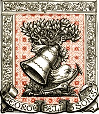

# Printers' Marks: A Chapter in the History of Typography <kbd>25663</kbd>

## Authors

 - Roberts, W. (William) <small>(1862 - 1940)</small>

## Subjects

 - Printers' marks

## Download

 - https://www.gutenberg.org/cache/epub/25663/pg25663.cover.medium.jpg
 - https://www.gutenberg.org/files/25663/25663-8.zip
 - https://www.gutenberg.org/files/25663/25663-0.txt
 - https://www.gutenberg.org/files/25663/25663-h/25663-h.htm
 - https://www.gutenberg.org/ebooks/25663.html.images
 - https://www.gutenberg.org/ebooks/25663.kindle.images
 - https://www.gutenberg.org/ebooks/25663.rdf
 - https://www.gutenberg.org/ebooks/25663.epub.images

## Book Shelves

