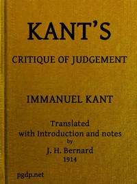

# Kant's Critique of Judgement <kbd>48433</kbd>

## Authors

 - Kant, Immanuel <small>(1724 - 1804)</small>

## Subjects

 - Judgment (Aesthetics)
 - Judgment (Logic)
 - Teleology

## Download

 - https://www.gutenberg.org/cache/epub/48433/pg48433.cover.small.jpg
 - https://www.gutenberg.org/files/48433/48433-0.zip
 - https://www.gutenberg.org/files/48433/48433-h.zip
 - https://www.gutenberg.org/files/48433/48433-h/48433-h.htm
 - https://www.gutenberg.org/ebooks/48433.html.images
 - https://www.gutenberg.org/ebooks/48433.epub.images
 - https://www.gutenberg.org/ebooks/48433.rdf
 - https://www.gutenberg.org/ebooks/48433.kindle.images

## Book Shelves

