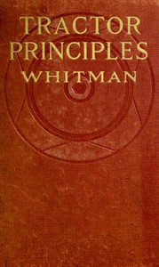

# Tractor Principles: The Action, Mechanism, Handling, Care, Maintenance and Repair of the Gas Engine Tractor <kbd>67569</kbd>

## Authors

 - Whitman, Roger B. (Roger Bradbury) <small>(1875 - 1942)</small>

## Subjects

 - Traction-engines

## Download

 - https://www.gutenberg.org/ebooks/67569.rdf
 - https://www.gutenberg.org/ebooks/67569.txt.utf-8
 - https://www.gutenberg.org/cache/epub/67569/pg67569.cover.medium.jpg
 - https://www.gutenberg.org/ebooks/67569.epub.images
 - https://www.gutenberg.org/ebooks/67569.kindle.images
 - https://www.gutenberg.org/files/67569/67569-0.txt
 - https://www.gutenberg.org/files/67569/67569-h/67569-h.htm
 - https://www.gutenberg.org/files/67569/67569-h.zip

## Book Shelves

