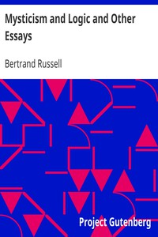

# Mysticism and Logic and Other Essays <kbd>25447</kbd>

## Authors

 - Russell, Bertrand <small>(1872 - 1970)</small>

## Subjects

 - Mathematics
 - Philosophy
 - Science

## Download

 - https://www.gutenberg.org/cache/epub/25447/pg25447.cover.medium.jpg
 - https://www.gutenberg.org/files/25447/25447-0.zip
 - https://www.gutenberg.org/files/25447/25447-8.txt
 - https://www.gutenberg.org/files/25447/25447-0.txt
 - https://www.gutenberg.org/ebooks/25447.html.images
 - https://www.gutenberg.org/files/25447/25447-h/25447-h.htm
 - https://www.gutenberg.org/ebooks/25447.rdf
 - https://www.gutenberg.org/ebooks/25447.epub.images
 - https://www.gutenberg.org/ebooks/25447.kindle.images

## Book Shelves

 - Philosophy
