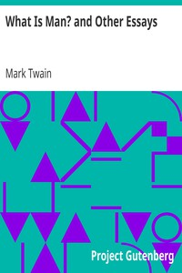

# What Is Man? and Other Essays <kbd>70</kbd>

## Authors

 - Twain, Mark <small>(1835 - 1910)</small>

## Subjects

 - American essays

## Download

 - https://www.gutenberg.org/files/70/70-0.zip
 - https://www.gutenberg.org/files/70/70-h.zip
 - https://www.gutenberg.org/cache/epub/70/pg70.cover.medium.jpg
 - https://www.gutenberg.org/ebooks/70.html.images
 - https://www.gutenberg.org/ebooks/70.kindle.images
 - https://www.gutenberg.org/ebooks/70.rdf
 - https://www.gutenberg.org/ebooks/70.epub.images

## Book Shelves

