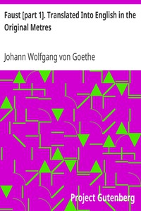

# Faust [part 1]. Translated Into English in the Original Metres <kbd>14591</kbd>

## Authors

 - Goethe, Johann Wolfgang von <small>(1749 - 1832)</small>

## Subjects

 - Faust, -approximately 1540 -- Drama
 - German poetry -- Translations into English
 - Legends -- Germany -- Drama
 - Magicians -- Drama

## Download

 - https://www.gutenberg.org/files/14591/14591.zip
 - https://www.gutenberg.org/cache/epub/14591/pg14591.cover.medium.jpg
 - https://www.gutenberg.org/files/14591/14591-h.zip
 - https://www.gutenberg.org/files/14591/14591-8.zip
 - https://www.gutenberg.org/files/14591/14591.txt
 - https://www.gutenberg.org/ebooks/14591.html.images
 - https://www.gutenberg.org/ebooks/14591.txt.utf-8
 - https://www.gutenberg.org/ebooks/14591.kindle.images
 - https://www.gutenberg.org/ebooks/14591.rdf
 - https://www.gutenberg.org/ebooks/14591.epub.images

## Book Shelves

 - Banned Books from Anne Haight's list
 - Best Books Ever Listings
 - Harvard Classics
