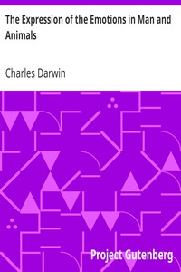

# The Expression of the Emotions in Man and Animals <kbd>1227</kbd>

## Authors

 - Darwin, Charles <small>(1809 - 1882)</small>

## Subjects

 - Emotions
 - Expression
 - Instinct
 - Psychology, Comparative

## Download

 - https://www.gutenberg.org/files/1227/1227-h.zip
 - https://www.gutenberg.org/ebooks/1227.html.images
 - https://www.gutenberg.org/files/1227/1227-0.zip
 - https://www.gutenberg.org/cache/epub/1227/pg1227.cover.medium.jpg
 - https://www.gutenberg.org/ebooks/1227.txt.utf-8
 - https://www.gutenberg.org/files/1227/1227-0.txt
 - https://www.gutenberg.org/ebooks/1227.epub.images
 - https://www.gutenberg.org/ebooks/1227.rdf
 - https://www.gutenberg.org/ebooks/1227.kindle.images

## Book Shelves

