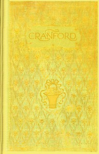

# Cranford <kbd>394</kbd>

## Authors

 - Gaskell, Elizabeth Cleghorn <small>(1810 - 1865)</small>

## Subjects

 - England -- Fiction
 - Female friendship -- Fiction
 - Older women -- Fiction
 - Pastoral fiction
 - Sisters -- Fiction
 - Villages -- Fiction

## Download

 - https://www.gutenberg.org/files/394/394-0.zip
 - https://www.gutenberg.org/files/394/394-h.zip
 - https://www.gutenberg.org/files/394/394-h/394-h.htm
 - https://www.gutenberg.org/cache/epub/394/pg394.cover.small.jpg
 - https://www.gutenberg.org/ebooks/394.kindle.images
 - https://www.gutenberg.org/ebooks/394.rdf
 - https://www.gutenberg.org/ebooks/394.epub.images

## Book Shelves

