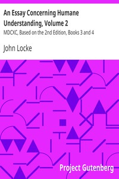

# An Essay Concerning Humane Understanding, Volume 2: MDCXC, Based on the 2nd Edition, Books 3 and 4 <kbd>10616</kbd>

## Authors

 - Locke, John <small>(1632 - 1704)</small>

## Subjects

 - Knowledge, Theory of -- Early works to 1800

## Download

 - https://www.gutenberg.org/files/10616/10616.txt
 - https://www.gutenberg.org/files/10616/10616.zip
 - https://www.gutenberg.org/cache/epub/10616/pg10616.cover.medium.jpg
 - https://www.gutenberg.org/ebooks/10616.txt.utf-8
 - https://www.gutenberg.org/ebooks/10616.epub.images
 - https://www.gutenberg.org/ebooks/10616.html.images
 - https://www.gutenberg.org/ebooks/10616.rdf
 - https://www.gutenberg.org/ebooks/10616.kindle.images

## Book Shelves

 - Banned Books from Anne Haight's list
