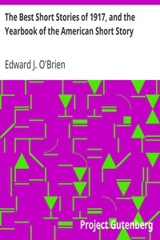

# The Best Short Stories of 1917, and the Yearbook of the American Short Story <kbd>20872</kbd>

## Authors

## Subjects

 - American fiction -- 20th century
 - Short stories, American

## Download

 - https://www.gutenberg.org/files/20872/20872-h/20872-h.htm
 - https://www.gutenberg.org/cache/epub/20872/pg20872.cover.small.jpg
 - https://www.gutenberg.org/files/20872/20872.zip
 - https://www.gutenberg.org/files/20872/20872-8.txt
 - https://www.gutenberg.org/files/20872/20872-8.zip
 - https://www.gutenberg.org/ebooks/20872.html.images
 - https://www.gutenberg.org/ebooks/20872.rdf
 - https://www.gutenberg.org/ebooks/20872.epub.images
 - https://www.gutenberg.org/ebooks/20872.kindle.images
 - https://www.gutenberg.org/ebooks/20872.txt.utf-8

## Book Shelves

