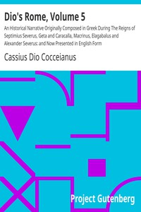

# Dio's Rome, Volume 5: An Historical Narrative Originally Composed in Greek During The Reigns of Septimius Severus, Geta and Caracalla, Macrinus, Elagabalus and Alexander Severus: and Now Presented in English Form <kbd>10890</kbd>

## Authors

 - Cassius Dio Cocceianus <small>(null - null)</small>

## Subjects

 - Rome -- History

## Download

 - https://www.gutenberg.org/cache/epub/10890/pg10890.cover.medium.jpg
 - https://www.gutenberg.org/files/10890/10890-h.zip
 - https://www.gutenberg.org/files/10890/10890.zip
 - https://www.gutenberg.org/files/10890/10890-8.txt
 - https://www.gutenberg.org/ebooks/10890.html.images
 - https://www.gutenberg.org/ebooks/10890.epub.images
 - https://www.gutenberg.org/ebooks/10890.rdf
 - https://www.gutenberg.org/files/10890/10890-h/10890-h.htm
 - https://www.gutenberg.org/ebooks/10890.kindle.images
 - https://www.gutenberg.org/files/10890/10890.txt

## Book Shelves

 - Classical Antiquity
